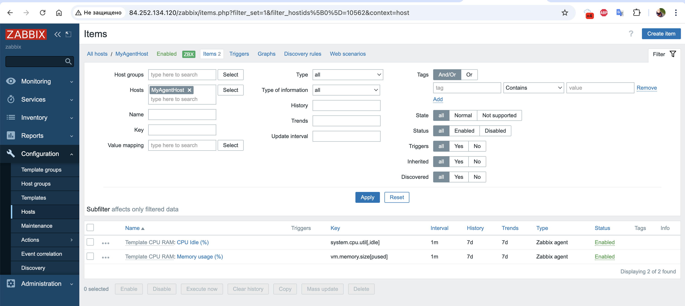
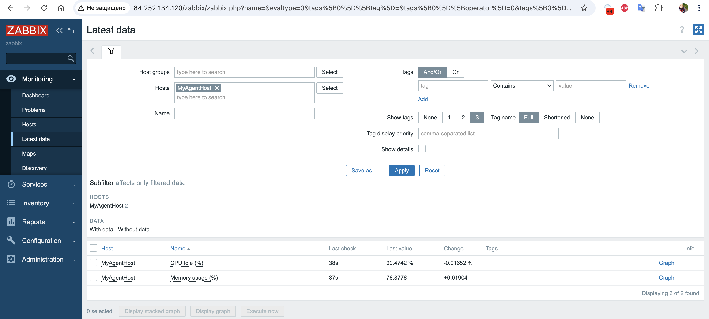
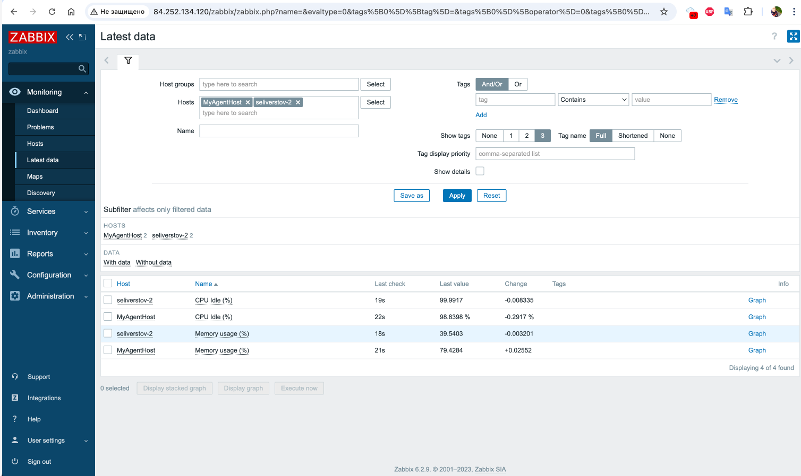
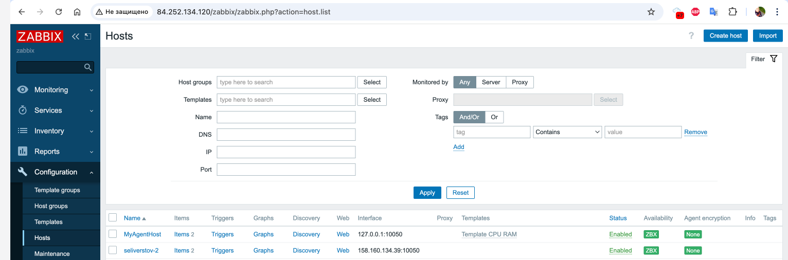

# Домашнее задание к занятию "`Zabbix 1`" - `Никита Селиверстов`

### Задание 1

   1. Устанавливаем zabbix на сервере яндекс клауд
   2. Выполняем следующие команды для установки
   `sudo apt update`
   `sudo apt upgrade -y`
   `sudo apt install postgresql`
   `sudo systemctl enable postgresql`
   `sudo systemctl start postgresql`

   3. Добавление репозитория Zabbix:
   `wget https://repo.zabbix.com/zabbix/6.2/debian/pool/main/z/zabbix-release/zabbix-release_6.2-2+debian11_all.deb`
   `sudo dpkg -i zabbix-release_6.2-2+debian11_all.deb`
   `sudo apt update`

   4. Установка пакетов Zabbix (с поддержкой PostgreSQL)
   `sudo apt install -y zabbix-server-pgsql zabbix-frontend-php \ php-pgsql zabbix-apache-conf zabbix-sql-scripts`
   5. Создание БД и пользователя zabbix. 
   `sudo -u postgres psql`
   `CREATE USER zabbix WITH ENCRYPTED PASSWORD 'zabbix'; CREATE DATABASE zabbix OWNER zabbix; \q`
   Импорт схемы Zabbix: `zcat /usr/share/zabbix-sql-scripts/postgresql/server.sql.gz | sudo -u postgres psql zabbix`
   6. Настройка /etc/zabbix/zabbix_server.conf
   DBName=zabbix
   DBUser=zabbix
   DBPassword=zabbix
   DBHost=localhost
   DBPort=5432
   7. Запуск и автозагрузка Zabbix Server и Apache
   `sudo systemctl enable zabbix-server apache2`
   `sudo systemctl start zabbix-server apache2`
   8. Открытие мастера установки в браузере
   `http://158.160.139.34/zabbix`
   Следуем инструкции и устанавливаем.
   

### Задание 2
   1. 
   2. 
   3. 